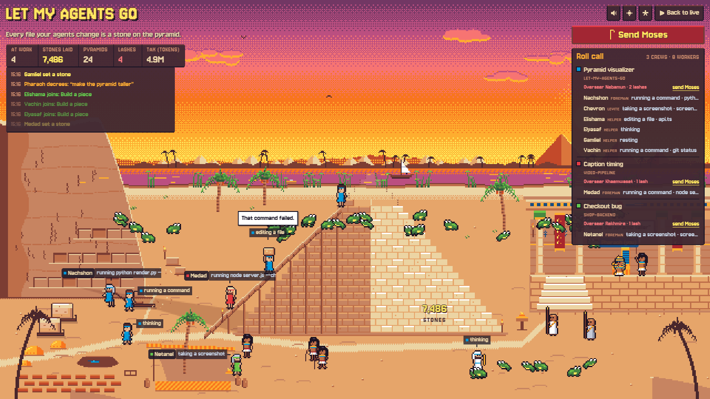

# Let My Agents Go

You can now watch your Claude Code agents work as Jewish slaves in Egypt.



Your agents build a pyramid one brick at a time, and each brick is a file they edit. Each prompt you send in is like Pharaoh giving a decree. The slave masters whip any agents that are slow. If a slave master gets too rough with an agent, you can send in Moses, and if anything breaks while the agents are working, a plague comes raining down on them.

## Run it

You need [Claude Code](https://claude.com/claude-code) and Node 18 or newer. Then run this in any terminal:

```
npx github:Mendypf/let-my-agents-go --open
```

Your browser opens http://localhost:4777, and every Claude Code session you have running shows up as its own crew. No agents working right now? Click **Watch demo**. It runs a scripted site where every scene fires within four minutes, and the camera moves in close on whatever is happening.

If you'd rather keep a copy:

```
git clone https://github.com/Mendypf/let-my-agents-go
cd let-my-agents-go
npm start
```

On Windows you can double-click `start.bat` instead. The app has no dependencies, so there is nothing else to install.

## Your code stays on your computer

- It only reads the session logs Claude Code already writes to `~/.claude/projects`. It never changes them.
- The server only accepts connections from your own computer (127.0.0.1), and it sends nothing anywhere. The one thing the page loads from the internet is its fonts, from Google Fonts.

Settings, if you need them: `PORT` (default 4777), `CLAUDE_PROJECTS_DIR` (if your logs live somewhere else), and `LMAG_CACHE_DIR` (where the stone count is kept; default `~/.cache/let-my-agents-go`).

## What you are looking at

| Your agent is... | On the site |
| --- | --- |
| reading files or searching the code | cutting stone at the quarry |
| running a command | hauling a block on the sledge |
| editing or writing a file | carrying a block up the ramp and setting it (one stone) |
| searching the web | gathering straw in the field (Shemot 5:12) |
| starting helper agents | calling new workers; the overseer lashes them into line |
| running a read-only helper (Explore, Plan) | a Levite with a scroll. Nobody whips a Levite (Rashi, Shemot 5:4) |
| asking you a question, or waiting for your OK | holding up a tablet with a "?" |
| finished its turn | sitting in the shade with a water jar |

Each Claude session is one crew, with its own color on the headbands and one Egyptian overseer.
Your prompts are Pharaoh's decrees. The overseer cracks the whip when a decree comes in, when a new helper joins, and every so often to keep the pace.

The pyramid holds 300 stones. When one is finished it joins the skyline, and a new one starts.
The number on the pyramid counts every file edit your agents have ever made.

## Buttons and keys

| | |
| --- | --- |
| **Send Moses** | In the roll call, or click an overseer. Moses looks this way and that, strikes him, and hides him in the sand. Then he runs to Midian for 60 seconds. |
| **Director** (D) | Buttons for every agent action (read, edit, run a command, add helpers, ask you, wait for your OK...) and every scene. Each has a key, shown on its button, and the keys work with the panel closed too. Agent actions work in the demo: the first crew's foreman does the action and the camera follows him. |
| **Sky** | Live follows your clock (dawn, day, golden hour, dusk, night). Or pick one. |
| **Sound** | Off until you click it (browser rule). |
| **Verse panel** | Hidden. Add `?verses` to the address to show the verse and Rashi for each scene. |

## What sets off each scene

| When | You see | Source |
| --- | --- | --- |
| Moses kills an overseer | he looks both ways, a burst of light, burial in the sand | Shemot 2:12; Rashi 2:14 (the Divine Name) |
| an agent writes a `.py` file | a magician's staff turns into a python | Shemot 7:12 |
| a command fails | the magicians turn the Nile to blood | Shemot 7:22 |
| the same command passes after failing | Aaron's staff swallows theirs | Rashi 7:12 |
| 3+ helpers in a minute | one frog splits into swarms | Rashi 8:2 |
| tests fail | the magicians can't make lice ("the finger of G-d") | Shemot 8:15; Rashi 8:14 |
| the Claude API errors | hail with fire inside it | Shemot 9:24; Rashi |
| a conversation gets summarized to free memory | darkness, but the workers keep their lamps | Shemot 10:23 |
| 5+ agents at once | locusts cover the sky | Shemot 10:15 |
| you turn down a request | Pharaoh's heart hardens | Shemot 7:22 |
| the model changes | a new king who knew not Joseph | Shemot 1:8; Rashi |
| 6 helpers in one message | six at one birth | Rashi 1:7 |
| a new session starts | Shifra and Puah bring the new worker | Rashi 1:15 |
| an edit doesn't land | the stone sinks into the sand (Pithom) | Sotah 11a |
| a helper fails | its sender, the officer, takes the lash | Rashi 5:14 |
| two agents edit the same file | Datan and Aviram argue | Rashi 2:13 |
| `git log` or `git blame` | Serach bat Asher and Joseph's coffin | Sotah 13a |
| a turn finishes in under 25 seconds | matzah: no time to rise | Shemot 12:39 |
| Claude starts another Claude | "Straw to Afarayim?" | Menachot 85a |
| first visit of the day | Pharaoh carries a brick himself | Midrash Tanchuma; Sotah 11b |
| early morning | Pharaoh sneaks down to the Nile | Rashi 7:15 |
| click the basket in the reeds | Batya's arm stretches | Sotah 12b; Rashi 2:5 |
| 300 stones | a gold capstone, and a note that the Torah says store cities, not pyramids | Shemot 1:11 |

Hebrew and Rashi were checked against Sefaria. Divine names are not written out.

## Files

- `server.js`: watches the session logs and streams events to the page (no dependencies).
- `lib/transcripts.js`: turns each log line into an event (tool call, result, prompt, error).
- `lib/stats.js`: counts every stone ever laid, cached in `~/.cache/let-my-agents-go`.
- `public/`: the page. All art is drawn in code with the Endesga 32 palette.
- `public/sfx/`: the sound effects, made with ElevenLabs.

## License

MIT
